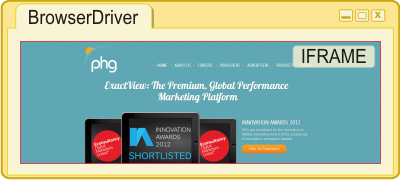

Each slave provides the test execution environment, runs the tests as commanded by the server and reports back test results. When testing UI, to avoid cross-domain issues the HTML page that loads the environment **must be part of the same site that is going to be tested**. This is needed because test code runs outside of the page being tested.

To turn a browser into a slave it must load a special HTML page which can be found as _BrowserDriver.html_ in the "client" folder of the package. When testing given website it is important to copy this page to the same server where the site will be loaded from and specify its url in the [browserDriverUrl](Configuration-file#wiki-server.browserDriverUrl) option in the [configuration file](Configuration-file). If for example performancehorizon.com needs to be tested then _BrowserDriver.html_ can be copied as _http://performancehorizon.com/BrowserDriver.html_ and in this url shall be set for "browserDriverUrl" in the configuration file. When all resources that the tests will need will be loaded from the BrowserDriver's server then _BrowserDriver.html_ can be used from the "client" folder and "browserDriverUrl" should only be adjusted if the [host](Configuration-file#wiki-server.SocketIO.host) option is specified.