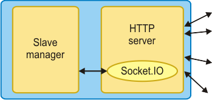

It’s built on [node.js](http://nodejs.org) and using a [configuration file](Configuration-file) it can be set to run in either automatic mode (to start all configured browsers or wait for them to connect after startup ) and run tests right away or interactive mode waiting for the user to send commands from a [management console](Management-console). Many of the options in the configuration file can be overridden with arguments passed on the command line.

The server uses [Socket.IO](http://socket.io/) to communicate with slaves and manager apps and provides HTTP server to serve files from configured directories. The document root that the web server uses is the "client" directory in the package and the configuration file can specify other directories to be mapped to needed paths.